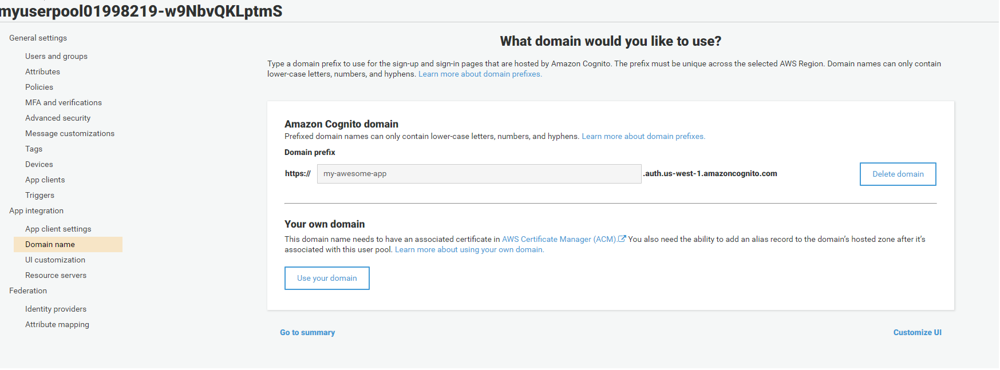
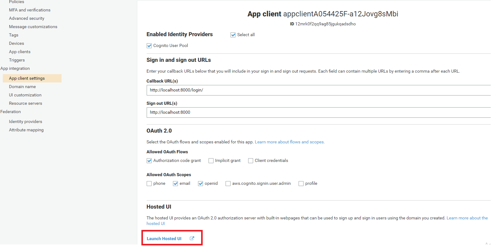
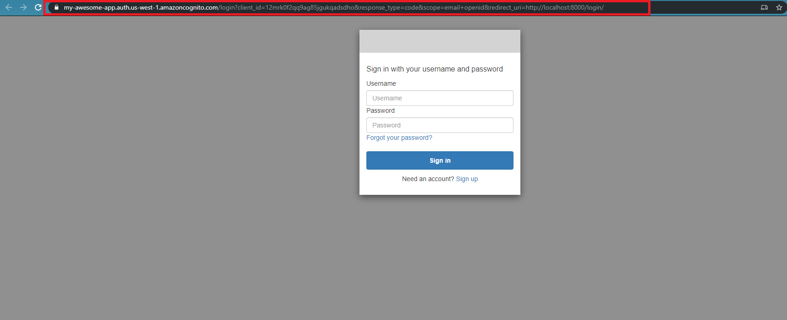

# Introduction

In the last step we say how to use third party logins. In this step we will see how to signup/login using cognito's own identity provider based on oauth2. In simple words we would be creating a domain which would have a login/signup form and we would also be attaching redirect URLs with it, so that after signing in or logging out, it can redirect the user back to our application.

In the last 2 examples we saw how to use Cognito with Amplify on the front-end. However, in this example, you will see how to manually communicate with the Cognito's authentication server from a user pool client to complete the authentication flow.


# Backend code explanation


## Initializing a user pool

Here we have simply initialized a user pool like we have been doing in the previous steps. To learn more about the parameters [click here](https://docs.aws.amazon.com/cdk/api/latest/docs/@aws-cdk_aws-cognito.UserPool.html)

```javascript

 const userPool = new cognito.UserPool(this, "myuserpool", {
      selfSignUpEnabled: true,
      userVerification: {
        emailSubject: "Verify your email for our awesome app!",
        emailBody:
          "Hello, Thanks for signing up to our awesome app! Your verification code is {####}",
        emailStyle: cognito.VerificationEmailStyle.CODE,
      },
      signInAliases: {
        username: true,
        email: true,
      },
      autoVerify: { email: true },
      signInCaseSensitive: false,
      standardAttributes: {
        fullname: {
          required: true,
          mutable: true,
        },
        email: {
          required: true,
          mutable: false,
        },
      },
      accountRecovery: cognito.AccountRecovery.EMAIL_ONLY,
    });


```


## Creating an app client for our user pool

An app is an entity within a user pool that has permission to call unauthenticated APIs (APIs that do not have an authenticated user), such as APIs to register, sign in, and handle forgotten passwords. To call these APIs, you need an app client ID and an optional client secret.

Cognito user pools also support using OAuth 2.0 framework for authenticating users. User pool clients can be configured with OAuth 2.0 authorization flows and scopes. Learn more about the [OAuth 2.0 authorization framework](https://tools.ietf.org/html/rfc6749) and [Cognito user pool's implementation](https://aws.amazon.com/blogs/mobile/understanding-amazon-cognito-user-pool-oauth-2-0-grants/) of OAuth2.0.


The following code configures an app client with the authorization code grant flow. It also registers callback and logoout redirect URLS (these come from your front-end, in this step we are using gatsby's local host). 

The scopes that we provide here are the pieces of information that our cognito app will request from the authentication server. In this example we have configured the access token scope to 'openid' and 'Email'.

```javascript


    const client = new cognito.UserPoolClient(this, "app-client", {
      userPool: userPool,
      generateSecret: true,
      oAuth: {
        flows: {
          authorizationCodeGrant: true,
        },
        scopes: [cognito.OAuthScope.OPENID, cognito.OAuthScope.EMAIL],
        callbackUrls: [`http://localhost:8000/login/`],
        logoutUrls: [`http://localhost:8000`],
      },
    });

```


## Creating a domain

After setting up an app client, the address for the user pool's sign-up and sign-in webpages can be configured using domains. There are two ways to set up a domain - either the Amazon Cognito hosted domain can be chosen with an available domain prefix, or a custom domain name can be chosen. The custom domain must be one that is already owned, and whose certificate is registered in AWS Certificate Manager.

The following code sets up a user pool domain in Amazon Cognito hosted domain with the prefix 'my-awesome-app'.


This domain will have the login/signup form. For more information [click here] (https://docs.aws.amazon.com/cognito/latest/developerguide/cognito-user-pools-app-integration.html#cognito-user-pools-create-an-app-integration)

```javascript

  const domain = userPool.addDomain("CognitoDomain", {
      cognitoDomain: {
        domainPrefix: "my-awesome-app",
      },
    });
```


## setting up sign-in url

Here we are just setting up the signin url with the domain that we created. This url must be present in the "callbackUrls" configuration in your user pool client construct.

The user be redirected to this url after they have logged in.

```javascript


    const signInUrl = domain.signInUrl(client, {
      redirectUri: `http://localhost:8000/login/`, // must be a URL configured under 'callbackUrls' with the client
    });
```


## Checking configuration in the cognito console

You can see our full domain in the image below. Our signin/login page is configured on this domain




The image below shows our App client settings that we did from cdk. Click on the link highlighted in red to see your login/singup page




This is how your login/signup page looks like. If you look at the url (highlighted in red), you will see that you have to enter some query parameters with your hosted domain to open the login/signup page

The standardized login/signup url on your domain should look like this

`${domainUrl}/login?client_id=${clientId}&response_type=code&scope=${scopes}&redirect_uri=${loginRedirectUri}`




When you will login, it should take you to the login redirect url that we configured in our cdk. In this example it is set to gatsby's local host. So you would need to run the front-end part of this example to see everything wworking.


# Front-end code explanation


