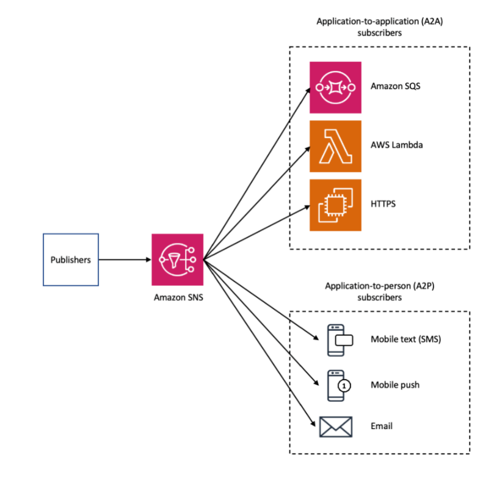

# Introduction

Amazon Simple Notification Service (Amazon SNS) is a managed service that provides message delivery from publishers to subscribers (also known as producers and consumers). Publishers communicate asynchronously with subscribers by sending messages to a topic, which is a logical access point and communication channel. Clients can subscribe to the SNS topic and receive published messages using a supported protocol, such as Amazon SQS, AWS Lambda, HTTP, email, mobile push notifications, and mobile text messages (SMS). 

>SNS block diagram:

>  

To learn more about SNS [click here](https://docs.aws.amazon.com/sns/latest/dg/welcome.html)

You can find more information on how to use SNS with AWS CDK [here](https://docs.aws.amazon.com/cdk/api/latest/docs/aws-sns-readme.html) and [here](https://docs.aws.amazon.com/cdk/api/latest/docs/aws-sns-subscriptions-readme.html)


# Using SNS with AWS CDK

## Creating an SNS topic in your stack

It just takes a few lines of code to add an SNS topic in your CDK stack. Creating topic is the first step in using SNS so that the other services can subscribe to it.

```javascript

import * as sns from '@aws-cdk/aws-sns';

const topic = new sns.Topic(this, 'Topic', {
    displayName: 'Customer subscription topic'
});

```

## Subscribing to the topic

Various subscriptions can be added to the topic by calling the .addSubscription(...) method on the topic. It accepts a subscription object, default implementations of which can be found in the @aws-cdk/aws-sns-subscriptions package.

There are 5 main types of subscriptions: HTTPS , lambda functions, Email, SMS and SQS

The example below shows how to subcribe a queue (SQS) to the topic 

```javascript

myTopic.addSubscription(new subs.SqsSubscription(queue));

```

## Filter Policy

A filter policy can be specified when subscribing an endpoint to a topic. In this case the endpoint would only recieve messages that would satisfy the filter policy.

In the example below we have a lambda subscription with a filter policy

```javascript

const myTopic = new sns.Topic(this, 'MyTopic');
const fn = new lambda.Function(this, 'Function', ...);

// Lambda should receive only message matching the following conditions on attributes:
// color: 'red' or 'orange' or begins with 'bl'
// size: anything but 'small' or 'medium'
// price: between 100 and 200 or greater than 300
// store: attribute must be present
topic.addSubscription(new subs.LambdaSubscription(fn, {
    filterPolicy: {
        color: sns.SubscriptionFilter.stringFilter({
            whitelist: ['red', 'orange'],
            matchPrefixes: ['bl']
        }),
        size: sns.SubscriptionFilter.stringFilter({
            blacklist: ['small', 'medium'],
        }),
        price: sns.SubscriptionFilter.numericFilter({
            between: { start: 100, stop: 200 },
            greaterThan: 300
        }),
        store: sns.SubscriptionFilter.existsFilter(),
    }
}));
```

## Dead letter Queue

CDK can attach provided Queue as DLQ for your SNS subscription. See the pSNS DLQ configuration docs](https://docs.aws.amazon.com/sns/latest/dg/sns-configure-dead-letter-queue.html) for more information about this feature.

Example of usage with user provided DLQ.

```javascript

const topic = new sns.Topic(stack, 'Topic');
const dlQueue = new Queue(stack, 'DeadLetterQueue', {
    queueName: 'MySubscription_DLQ',
    retentionPeriod: cdk.Duration.days(14),
});

new sns.Subscription(stack, 'Subscription', {
    endpoint: 'endpoint',
    protocol: sns.SubscriptionProtocol.LAMBDA,
    topic,
    deadLetterQueue: dlQueue,
});

```

## CloudWatch Event Rule Target

SNS topics can be used as targets for CloudWatch event rules.

```javascript

import * as targets from '@aws-cdk/aws-events-targets';

codeCommitRepository.onCommit(new targets.SnsTopic(myTopic));
```

This will result in adding a target to the event rule and will also modify the topic resource policy to allow CloudWatch events to publish to the topic.


[Step 17 and 18 Video in English on Facebook](https://www.facebook.com/zeeshanhanif/videos/10225602951765493)

[Step 17 and 18 Video in English on YouTube](https://www.youtube.com/watch?v=pHTtY_o-WO0)


