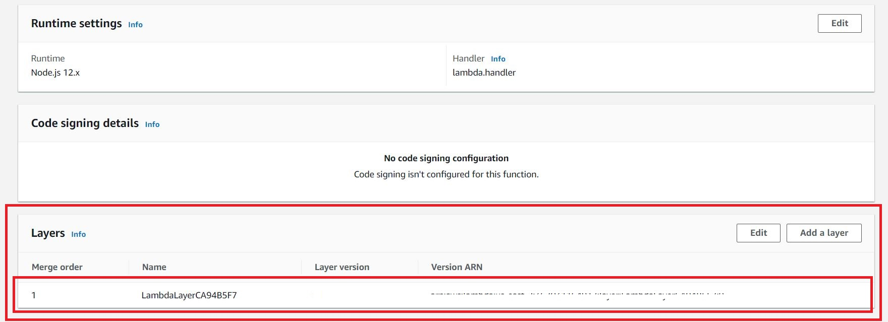

# How to deploy a lambda function with single layer using CDK

In this example you will learn, that [how to simply deloy a lambda function with single lambda layer](https://www.youtube.com/watch?v=-r4GJlkdJo0 "how to simply deloy a lambda function with single lambda") using CDK, which is very easy to do.

### Step 1: Setup a CDK directory
`cdk init app --language typescript`

<br>

### Step2: Install the following dependency
`npm install @aws-cdk/aws-lambda`

<br>

### Step3: Setup Lambda function
Create a new folder as **lambda-fns** in the cdk root dir and add a file as **lambda.ts**.
```javascript
// lambda-fns/lambda.ts

const axios = require('axios');

exports.handler = async (event: any, context: any) => {
    const result = await axios.get('https://jsonplaceholder.typicode.com/todos/1');
    return result.data;
}
```
<br>

> **Note:** Make sure do not add the axios dependency in your lambda folder. We will add the dependency with the help of lambda layer which we will cover in the next step.

<br>

### Step4: Setup Lambda Layer
Create a new folder as **lambda-layer** in the cdk root dir and add new folder as **nodejs** inside **lambda-layer**. 
Inside **nodejs** run the following commands.
- `npm init -y`
- `npm install axios`

> **Note:** Make sure that the folder **nodejs** that you have created, that name should be "nodejs" because during deployment this folder will be added into zip file and uploaded to the aws so when your lambda will try to call any module which is not available in it's root directory then your lambda will try to extract that module from "nodejs" which is present in your attached layer and as we are working in nodejs environment this format will be required, otherwise if you named it randomly your lambda will generate an error. Like wise if you are using python environment so instead of "nodejs" you will make "python" folder with having all python dependencies.

<br>

### Step5: Setup Your CDK Stack

```javascript
// lib/stack.ts

import * as cdk from '@aws-cdk/core';
import * as lambda from '@aws-cdk/aws-lambda';

export class Stack extends cdk.Stack {
  constructor(scope: cdk.Construct, id: string, props?: cdk.StackProps) {
    super(scope, id, props);

    // The code that defines your stack goes here

    const lambdaLayer = new lambda.LayerVersion(this, "LambdaLayer", {
      code: lambda.Code.fromAsset('lambda-layer'),
    });

    new lambda.Function(this, 'LambdaWithLambdaLayer', {
      runtime: lambda.Runtime.NODEJS_12_X, // execution environment
      code: lambda.Code.fromAsset('lambda-fns'),  // code loaded from the "lambda" directory
      handler: 'lambda.handler',  // file is "lambda", function is "handler"
      layers: [lambdaLayer]
    });
  }
}
```
<br>

### Step6: Lets deploy
After completing the above steps run the following commands to deploy:
- `npm run build`
- `cdk deploy`

<br>

### Step7: Test Your Lambda
Now at last if every things done according to the steps above, just go to your lambda console and test you lambda.
[How to test a lambda function in aws console](https://www.youtube.com/watch?v=seaBeltaKhw&feature=youtu.be&t=310 "How to test a lambda function in aws console").
 
Your can also check the lambda layer in your aws console. Go to your **Code** tab scroll down and you can see the lambda layer.

       

