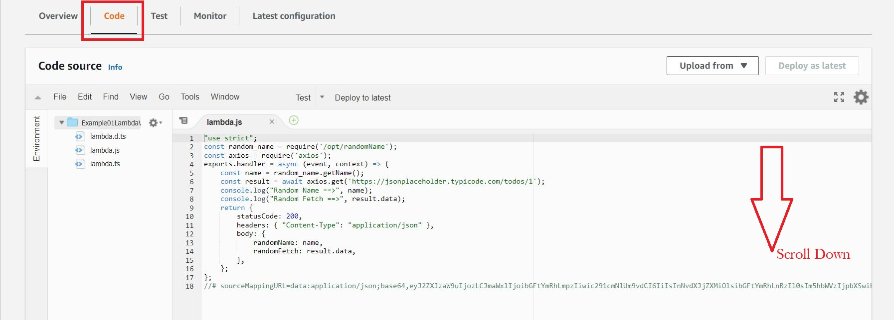

# How to deploy a lambda function with multiple layers using CDK

In this example you will learn, that how to deloy a lambda function with multiple lambda layers using CDK. For this tutorial I prefer this [video](https://www.youtube.com/watch?v=i12H4cUFudU "vidoe").

### Step 1: Setup a CDK directory
`cdk init app --language typescript`

<br>

### Step2: Install following dependency
`npm install @aws-cdk/aws-lambda`

<br>

### Step3: Setup Lambda function
Create a new folder as **lambda-fns** in the cdk root dir and add a file as **lambda.py**.
```python
// lambda-fns/lambda.py

import requests
import json
import randomName

def handler(event, context):    

    name = randomName.getName()    
    result = requests.get('https://jsonplaceholder.typicode.com/todos/1')    
    
    print("Random Name ==>", name)
    print("Random Fetch ==>", result.json())

    return {
        'statusCode': 200,
        'headers': { "Content-Type": "application/json" },
        'body': {
            'randomName': name,
            'randomFetch': result.json(),
        },
    }
```
> **Note:** Make sure do not add any dependencies which is imported in the lambda code. We will add these dependencies with the help of lambda layers which we will cover in the next step. Here it is very important to understand that when a Layer (or ZIP archive) is loaded into AWS Lambda, it is placed/unzipped to the /opt folder. For our Python lambda function to import the libraries contained in the Layer, the libraries should be placed under the python sub-directory of the /opt folder

<br>

### Step4: Setup Lambda Layer
Create a new folder as **lambda-layers** in the cdk root directory and inside that create two new folders as **http** and **nameGenerator**. After that create **python** folder inside both the **http** and **nameGenerator** folders and do the following steps.
- Run the following commands inside **http/python**
1. `create requirements.txt and put package dependency inside to install`
requests==2.25.1
1. `pip install -r requirements.txt -t .`

- Run the following commands inside **nameGenerator/python**
1. `create requirements.txt and put package dependency inside to install`
namegenerator==1.0.6
1. `pip install -r requirements.txt -t .`


- Add **randomName.py** inside **nameGenerator** folder and add the following code.

```python
// nameGenerator/randomName.py
import namegenerator

def getName():
    text = namegenerator.gen()
    print(text)
    return text
```
> **Note:** Make sure that the folder **python** that you have created, that name should be "python" because during deployment this folder will be added into zip file and uploaded to the aws so when your lambda will try to call any module which is not available in it's root directory then your lambda will try to extract that module from "python" which is present in your attached layer and as we are working in python environment this format will be required, otherwise if you named it randomly your lambda will generate an error. 

<br>

### Step5: Setup Your CDK Stack
```javascript
// lib/stack.ts

import * as cdk from '@aws-cdk/core';
import * as lambda from '@aws-cdk/aws-lambda';

export class Stack extends cdk.Stack {
  constructor(scope: cdk.Construct, id: string, props?: cdk.StackProps) {
    super(scope, id, props);

    // The code that defines your stack goes here

    const httpLayer = new lambda.LayerVersion(this, "HttpLayer", {
      code: lambda.Code.fromAsset('lambda-layers/http'),
      compatibleRuntimes: [lambda.Runtime.PYTHON_3_7], // optional 
    })
    const nameGenerator = new lambda.LayerVersion(this, "NameGeneratorLayer", {
      code: lambda.Code.fromAsset('lambda-layers/nameGenerator'),
      compatibleRuntimes: [lambda.Runtime.PYTHON_3_7], // optional 
    })

    new lambda.Function(this, "LambdaWithLayer", {
      runtime: lambda.Runtime.PYTHON_3_7,
      code: lambda.Code.fromAsset('lambda-fns'),
      handler: 'lambda.handler',
      layers: [httpLayer, nameGenerator],
    })
  }
}

```

<br>

### Step6: Lets deploy
After completing the above steps run the following commands to deploy
- `npm run build`
- `cdk deploy`

<br>

### Step7: Test Your Lambda
Now at last if every things done according to the steps above, just go to your lambda console and test you lambda.
[How to test a lambda function in aws console](https://www.youtube.com/watch?v=seaBeltaKhw&feature=youtu.be&t=310 "How to test a lambda function in aws console")

 
Your can also check the lambda layers in your aws console. Go to your **Code** tab scroll down and you can see the lambda layer

       


