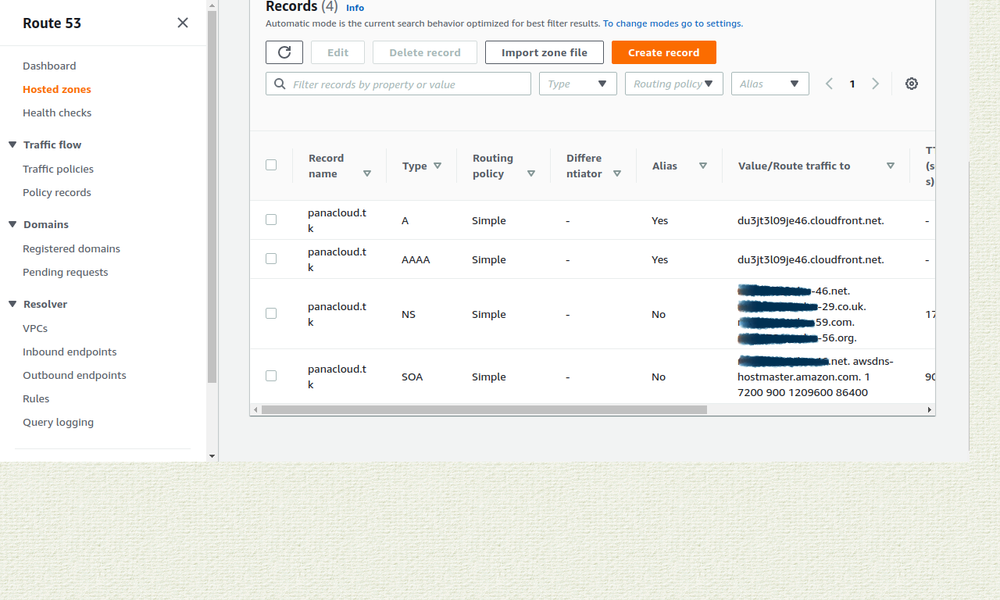
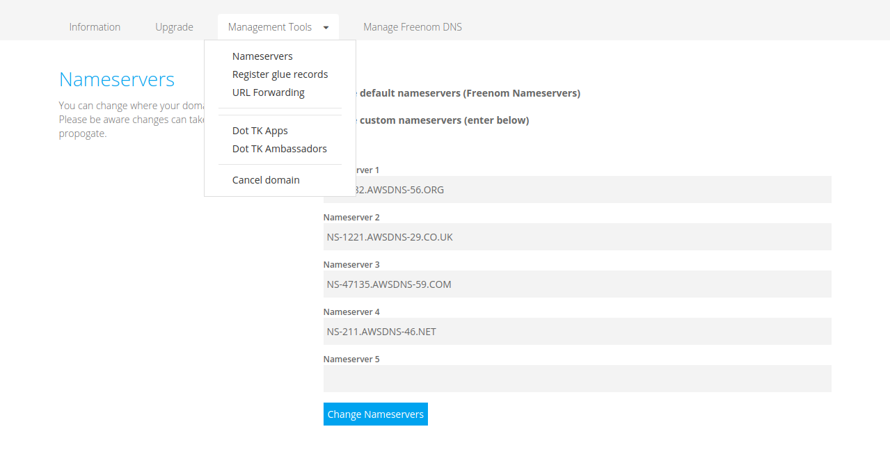

# Introduction
## What is DNS?
he Domain Name System (DNS) is a global infrastructure that translates human-readable hostnames into IP addresses. Organizations using Amazon Web Services (AWS) are running machines in the cloud, and need a mechanism to translate user requests into the correct Amazon IP address.

On the cloud, IP addresses can frequently change, as services move between physical machines and data centers. An AWS DNS solution must be able to adapt to these changes and propagate them quickly to DNS clients. Amazon’s official DNS solution is called Route 53.
## What is Route 53?
Route 53 is a managed DNS service from Amazon Web Services, intended for managing DNS for machines and services deployed on Amazon’s public cloud. Route 53 connects user requests to infrastructure running on AWS, such as Amazon EC2 instances, ELB load balancers or Amazon S3 buckets.
## Route 53 Key Features
- Traffic flow—routes end users to the endpoint that should provide the best user experience
- Latency-based routing—routes users to the AWS region that provides the lowest latency
- Health checks—monitors health and performance of applications
- Private DNS—for users of Amazon VPC, defines custom domain names without exposing DNS information publicly
#### Reference
[AWS DNS—Route 53 Features, Pricing and Limitations](https://ns1.com/resources/aws-dns?ns1_gad&utm_medium=ppc&utm_campaign=KB_DSA_Miner&utm_source=adwords&utm_term=&hsa_net=adwords&hsa_acc=2820460118&hsa_mt=b&hsa_ad=460843015360&hsa_src=g&hsa_ver=3&hsa_cam=1455218152&hsa_grp=116479372748&hsa_tgt=dsa-19959388920&hsa_kw=&gclid=CjwKCAiA_eb-BRB2EiwAGBnXXvQDAkWJp_6pkLy_6y6nySt-iJsPsXYAEpx6XscmfHcnlQlMBrQqsBoClaQQAvD_BwE) 


## Domain Name
Domain Name System is the phonebook of the internet. The general purpose of a nameserver is to translate domain names to IP addresses. So when you type in `panacloud.com` in your browser, first there will be a request to a DNS server to obtain the site's IP address. Using the Route 53 DNS service from AWS you can configure your domain's DNS records or even buy a new domain there. 

## Hosted zone
A hosted zone is a container for records, and records contain information about how you want to route traffic for a specific domain, such as example.com, and its subdomains (acme.example.com, zenith.example.com). A hosted zone and the corresponding domain have the same name. There are two types of hosted zones.
- Public hosted zones contain records that specify how you want to route traffic on the internet.
- Private hosted zones contain records that specify how you want to route traffic in an Amazon VPC. 

#### Reference
[Working with hosted zones](https://docs.aws.amazon.com/Route53/latest/DeveloperGuide/hosted-zones-working-with.html)


## Nameserver
Nameserver is a server on the Internet specialized in handling queries regarding the location of the domain name's various services. In easy words, name servers define your domain's current DNS provider. All domains usually have at least two DNS servers which can be checked via Whois lookup tool.


### Note
- **Route 53** is a Paid service. Check Route 53 [Pricing](https://aws.amazon.com/route53/pricing/)

## Resources
[AWS Route53 — Records & Routing Policies](https://medium.com/@kumargaurav1247/aws-route53-records-routing-policies-f3657b01ffa2)

## Step 1

Initialize new CDK project and install following dependencies
```bash
npm install @aws-cdk/aws-cloudfront
npm install @aws-cdk/aws-cloudfront-origins
npm install @aws-cdk/aws-route53
npm install @aws-cdk/aws-route53-targets 
npm install @aws-cdk/aws-s3
npm install @aws-cdk/aws-s3-deployment
``` 

## Step 2
Add the following constructs in your stack
```typesscript
// create a bucket to upload your app files
const websiteBucket = new s3.Bucket(this, "WebsiteBucket", {
  versioned: true,
});

// create a CDN to deploy your website

const distribution = new cloudfront.Distribution(this, "Distribution", {
  defaultBehavior: {
    origin: new origins.S3Origin(websiteBucket),

    
  },
  defaultRootObject: "index.html",
  enableIpv6:true,
  

  
});


// housekeeping for uploading the data in bucket 
new s3deploy.BucketDeployment(this, "DeployWebsite", {
  sources: [s3deploy.Source.asset("./website")],
  destinationBucket: websiteBucket,
  distribution,
  distributionPaths: ["/*"],
});

//creating hosted zone for our domain
const myZone= new route53.PublicHostedZone(this, 'HostedZone', {
  zoneName: 'panacloud.tk',


});

// Adding AAAA(ipv6) record
new route53.AaaaRecord(this, 'Alias', {
  zone: myZone,
  target: route53.RecordTarget.fromAlias(new targets.CloudFrontTarget(distribution)),

});

// Adding A(ipv4) record
new route53.ARecord(this, 'AliasA', {
  zone: myZone,
  target: route53.RecordTarget.fromAlias(new targets.CloudFrontTarget(distribution)),

});

```
## Step 3
Create frontend of your website in my case, I created `website` folder in my root directory and simply created a `Hello World` file inside of it.

Now build the project and deploy it on cloudformation


## Step 4
**Note**: If you have other services attached to your domain - like email or subdomains - those will stop working after changing nameservers. So unless you know what you are doing I suggest creating a new domain to play with AWS - you can get a free domain on [freenom.com](https://www.freenom.com/). It is possible to retain all existing services but it requires different configuration.

1. Now after creating a new domain, go back to the AWS route 53 service. On the Hosted zones main page click on your domain (which you’ve just created).

2. Inside of NS type record you can find nameservers. generally there are 4 nameservers.


3. On the new tab go to your domain registrar in my case, it's `freenom.com`, So I headed there and from My domains I selected Manage Domain. You have to find an option to set custom nameservers, and provide nameservers for your domain listed in Route 53.


After that, my app is available at `panacloud.tk`


## Note
Propagation of changes in DNS may take time (up to 24 hours) so don’t panic if you can’t see your site right away.
