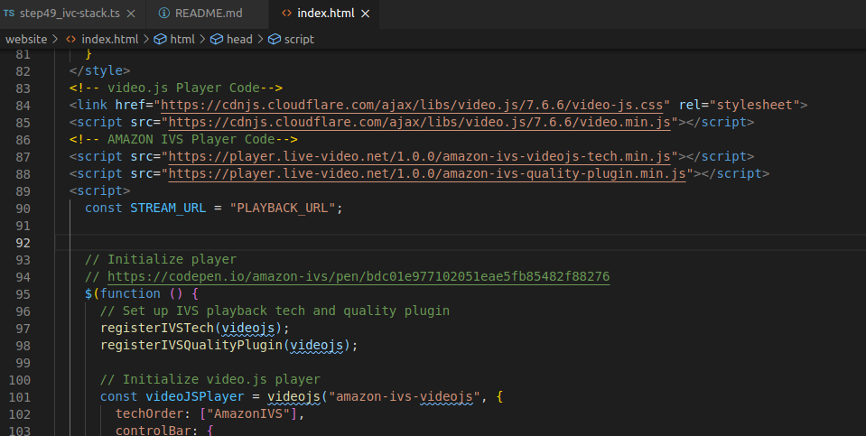
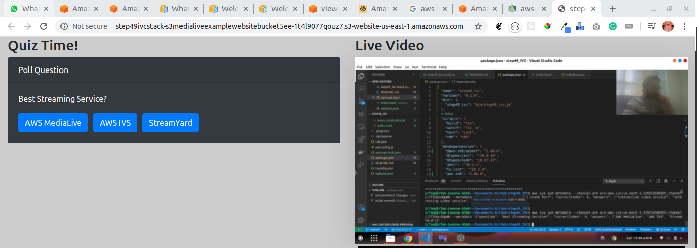

# Amazon Interactive Video Service (AWS IVS)!
Amazon Interactive Video Service (Amazon IVS) is a managed live streaming solution that is quick and easy to set up, and ideal for creating interactive video experiences. Send your live streams to Amazon IVS using streaming software and the service does everything you need to make low-latency live video available to any viewer around the world, letting you focus on building interactive experiences alongside the live video. You can easily customize and enhance the audience experience through the Amazon IVS player SDK and timed metadata APIs, allowing you to build a more valuable relationship with your viewers on your own websites and applications..

## MediaLive API / Documentation Reference
https://docs.aws.amazon.com/ivs/latest/userguide/what-is.html
https://docs.aws.amazon.com/ivs/latest/APIReference/Welcome.html

## Pricing Chart.
https://aws.amazon.com/ivs/pricing/#Live_Video_Input_Costs

## NPM install.
- npm install @aws-cdk/aws-ivs
- cdk bootstrap && npm run build && cdk deploy

# After Deployment.

## Install Streaming Application
- [Desktop] :  install OBS Studeio https://obsproject.com/download    or
- [MobileApp] : Larix Broadcaster (Android)

## Setup the Streaming application !
    copy the below information from AWS IVS console 

- Ingest server : use as url/server key in streaming application 
- Stream key : use as streaming key / secret key 
- Playback URL : for the streaming output 

## OBS Studio setup

Select the type of streaming source (camera/screen...) and click on "setting"

Copy the "Ingest Server key" and "Streaming Key" here 

## Simple Stream Testing
Copy the Playback URL (from cdk-deploy outPut or console  IVS/channel_Name/Playback Url)

## Streaming with  with push_metaData
- Step 1 : Copy the Playback URL 

- Step 2 : copy and paste bellow command in terminal .. 
aws ivs put-metadata --channel-arn arn:aws:ivs:us-east-1:abcd1234:channel/abcd1234 --metadata '{"question": "Best Streaming Service?", "correctIndex": 0, "answers": ["AWS MediaLive", "AWS IVS", "StreamYard"]}'

## Result, with push_metaData

## Mobile Application

Setting > Connections > New Connection >
name : abcd
url : Ingest_Server_Key/Streaming key ( rtmps://abcd1234.global-contribute.live-video.net:443/app/sk_us-east-1_abcdefg123456)

save & start recording

## Useful commands

 * `npm run build`   compile typescript to js
 * `npm run watch`   watch for changes and compile
 * `npm run test`    perform the jest unit tests
 * `cdk deploy`      deploy this stack to your default AWS account/region
 * `cdk diff`        compare deployed stack with current state
 * `cdk synth`       emits the synthesized CloudFormation template