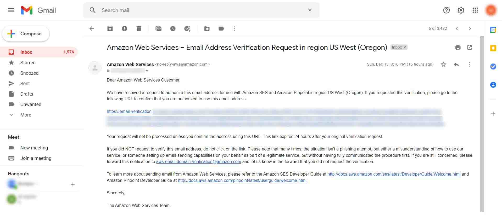
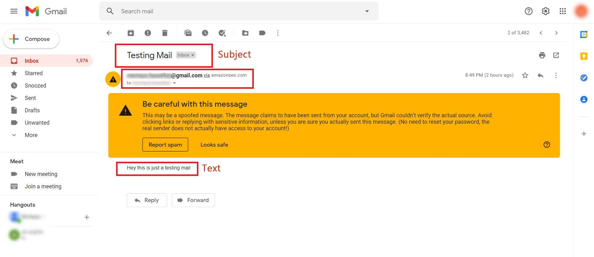

# Sending Email Using SES And Lambda
In this example we are going to take a look at how to create a restful endpoint to send an email, which is pretty straightforward with CDK. To do so we need a Lambda function, an Apigateway and an IAM role to allow access of SES to the Lambda.

- [How to send an email with Amazon SES and Serverless - tutorial
](https://www.youtube.com/watch?v=4o6GCiUX8Xk)
- [How do I send email using Lambda and Amazon SES?](https://aws.amazon.com/premiumsupport/knowledge-center/lambda-send-email-ses/#:~:text=To%20send%20email%20from%20Lambda,to%20execute%20the%20API%20call.)

<br>

### Step 1: Setup a CDK directory
`cdk init app --language typescript`

<br>

### Step2: Install The Following Dependencies
`npm install @aws-cdk/aws-lambda @aws-cdk/aws-apigateway @aws-cdk/aws-iam aws-lambda @types/aws-lambda aws-sdk`

<br>

### Step3: Setup Lambda Function
In our example we are using `aws-sdk` to send the email from SES, so we need to import it inside your lambda function. Create a new folder as **lambda-fns** in the cdk root directory and add a file as **lambda.ts** inside it.

```javascript
// lambda-fns/lambda.ts
import { APIGatewayProxyEvent, APIGatewayProxyResult, Context } from 'aws-lambda';
import { SES } from "aws-sdk";

const ses = new SES();

interface EmailParam {
    to?: string;
    from?: string;
    subject?: string;
    text?: string;
}

export async function handler(event: APIGatewayProxyEvent, context: Context): Promise<APIGatewayProxyResult> {
    console.log("REQUEST ==>>", event.body);

    const { to, from, subject, text } = JSON.parse(event.body||"{}") as EmailParam;

    if (!to || !from || !subject || !text) {
        return Responses._400({
            message: 'to, from, subject and text are all required in the body',
        });
    }

    const params = {
        Destination: {
            ToAddresses: [to],
        },
        Message: {
            Body: {
                Text: { Data: text },
            },
            Subject: { Data: subject },
        },
        Source: from,
    };

    try {
        await ses.sendEmail(params).promise();
        return Responses._200({ message: 'The email has been sent' });
    } catch (error) {
        console.log('error sending email ', error);
        return Responses._400({ message: 'The email failed to send' });
    }


}


const Responses = {
    _200(data: Object) {
        return {
            headers: {
                'Content-Type': 'application/json',
                'Access-Control-Allow-Methods': '*',
                'Access-Control-Allow-Origin': '*',
            },
            statusCode: 200,
            body: JSON.stringify(data),
        };
    },

    _400(data: Object) {
        return {
            headers: {
                'Content-Type': 'application/json',
                'Access-Control-Allow-Methods': '*',
                'Access-Control-Allow-Origin': '*',
            },
            statusCode: 400,
            body: JSON.stringify(data),
        };
    },
};
```

<br>

### Step4: Setup Your CDK Stack
```javascript
// lib/stack.ts
import * as cdk from '@aws-cdk/core';
import * as lambda from "@aws-cdk/aws-lambda";
import * as apigw from "@aws-cdk/aws-apigateway";
import { Effect, PolicyStatement, Role, ServicePrincipal } from '@aws-cdk/aws-iam';

export class Stack extends cdk.Stack {
  constructor(scope: cdk.Construct, id: string, props?: cdk.StackProps) {
    super(scope, id, props);

    // The code that defines your stack goes here

    // Creating a IAM role for lambda to give access of ses send email
    const role = new Role(this, 'LambdaRole', {
      assumedBy: new ServicePrincipal('lambda.amazonaws.com'),
    });
    ///Attaching ses access to policy
    const policy = new PolicyStatement({
      effect: Effect.ALLOW,
      actions: ["ses:SendEmail", "ses:SendRawEmail", "logs:*"],
      resources: ['*']
    });
    //granting IAM permissions to role
    role.addToPolicy(policy);

    //  Creating send email lambda handler
    const emailSender = new lambda.Function(this, "HandleSendEmail", {
      runtime: lambda.Runtime.NODEJS_10_X,
      code: lambda.Code.fromAsset("fns-lambda"),
      handler: "lambda.handler",
      role: role
    });

    // create the API Gateway with one method and path For lambda
    const api = new apigw.RestApi(this, "SendEmailEndPoint")
    api
      .root
      .resourceForPath("sendmail")
      .addMethod("POST", new apigw.LambdaIntegration(emailSender))


    // logging API endpoint
    new cdk.CfnOutput(this, 'Send email endpoint', {
      value: `${api.url}sendmail`
    });
  }
}

```

<br>

### Step5: Lets deploy
After completing the above steps run the following commands to deploy:
- `npm run build`
- `cdk deploy`
> **NOTE**: after deployment you will get a **Sendemailendpoint** printed in your terminal which will be you actual API for sending emails.

<br>

### Step6: Verify The Email
To send email from SES you have to verify your email first which you want to use to send emails. 

- First go to your **AWS Simple Email Service** console.

- Go to **Email Addressess** Tab.

- Click on **Verify a New Email Address** button.

- Write you email in the input field and click on **Verify This Email Address** button.

- After that you will get a verfication email. In my case as I'm using Gmail, so I received my email at **Gmail**. 

<br>

### Step7: Testing Endpoint
To test the endpoint I'm using [Postman](https://www.postman.com/).

- #### Request


<br>

- #### Response 


<br>

- #### Email Response


> **NOTE:** If you do not received any email in your **Inbox** than maybe you have received your email inside **SPAM** tab.
